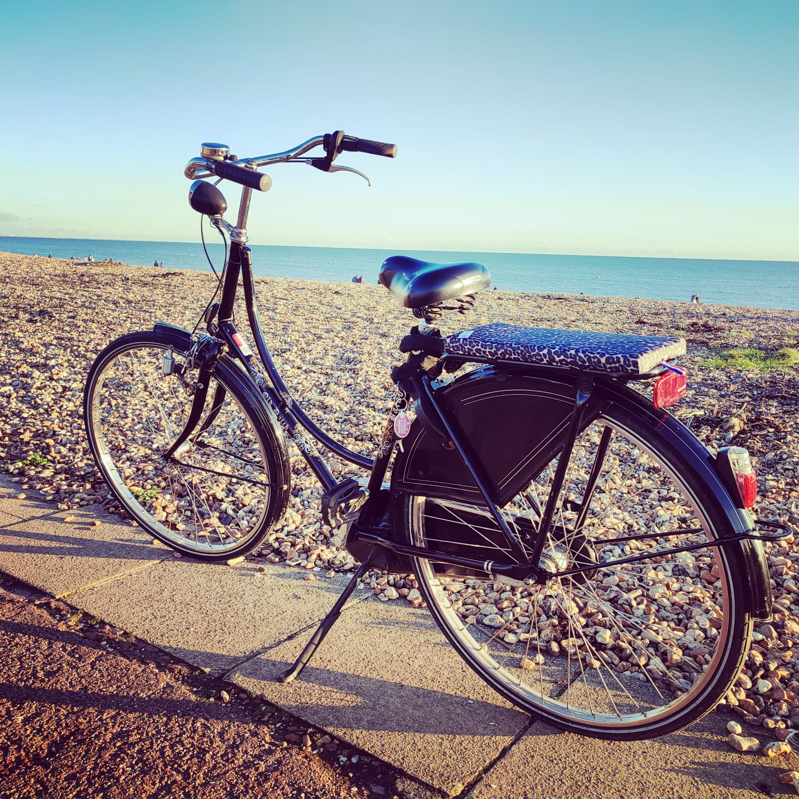

Looking for a fun and active way to spend Easter weekend in Portsmouth? Dust off your bike and hit the beautiful Portsmouth coastline for a scenic cycle! With the weather expected to turn a corner, it's the perfect time to explore the city on two wheels.

Cruise along the vibrant Portsmouth seafront, taking in the fresh sea air and stopping off at one of the many cafes that dot the route. If you're feeling more adventurous, head towards Castle Road, with its charming cafes (check opening times for Easter weekend).  For a tranquil escape, Hilsea Lido offers a lovely cafe nestled beside the lake - perfect for a post-cycle refreshment.

Feeling energetic?  Milton Common provides ideal terrain for off-road cycling in natural surroundings that will get your heart pumping!

Why not make it a social affair? Cycling is even more enjoyable with family and friends. Invite your loved ones to join you and create lasting Easter memories.  There are [quieter routes](https://www.visitportsmouth.co.uk/dbimgs/Quieter%20Routes%20Cycle%20Map.pdf) all over the island and they're all clearly signed once you know what to look for.

Don't have a bike? No problem! [Portsmouth's Beryl bike share scheme](https://beryl.cc/scheme/portsmouth) lets you rent a bike for a short trip around the city.

So, what are you waiting for? Get ready for a fun-filled Easter weekend exploring Portsmouth by bike!

If you love cycling and are passionate about making Portsmouth an even better cycling city, please consider becoming a member of Portsmouth Cycle Forum. We work tirelessly to improve cycling infrastructure and promote a safe and enjoyable cycling experience for everyone.
