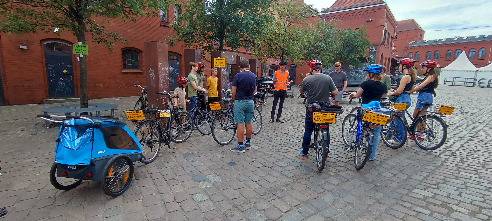
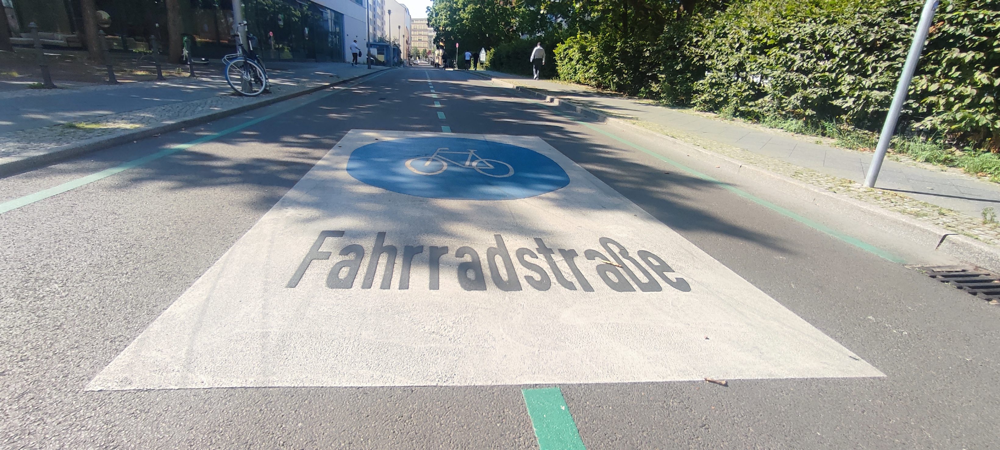
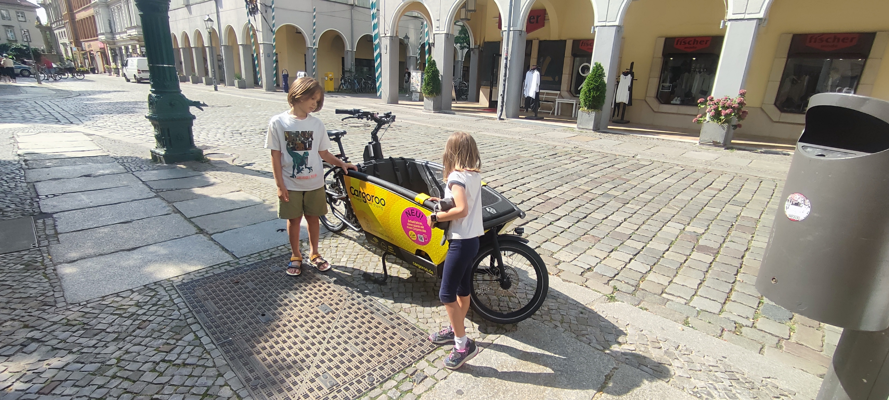

# Background

It’s family holiday time, and while we’ve been busy with our [#werideportsmouth](/tags/werideportsmouth) project, we know many of you are enjoying some well-deserved time off as well. As the academic year winds down and holidays begin, it was tricky to get the next [#werideportsmouth](/tags/werideportsmouth) story together - but we didn’t want to miss our timeline, so we added a fun holiday twist! This time, we’re sharing a story from our three-day break in Berlin, the vibrant capital of Germany, with our experiences, insights, and tips for cycling in this fantastic city.

# Using bikes on holidays and why cycle while away

As a family with two primary-aged kids, cycling on holidays in many places we’ve visited hasn’t always been straightforward. However, with some advance planning and research, we always try to make it work because it’s the best way for us to explore new places. Because we can see more of the area and entertain the kids at the same time, as they’re usually busy pedalling or observing everything around them from a more ‘people-friendly level’ than public transport or a private car. Ever had a kid say, ‘I’m tired of walking,’ or ‘Are we there yet?’ Well, this rarely happens to us when we cycle, and we believe it’s due to the magic of cycling. By cycling around, we can also be more flexible and tend to their needs more easily while satisfying our curiosity about the new place we’re visiting.

While travelling with children, we have noticed that some places make it easier for visitors to cycle around than others. Berlin is one of those places, offering plenty of options for families with kids of all ages.

During our break in Berlin, we joined a 15 km cycle tour of the city organised by Berlin on Bikes. Even though the tour was geared towards adults, they made it super easy for us as a family. Our 8-year-old got a kids’ bike (there were lots of size options), and our 6-year-old daughter chose to ride in a trailer. There were also tag-alongs and bicycle seats to choose from, so as a family we were spoilt for choice.

Beyond the organized tour, the same company offered bikes for hire to explore on our own. There were also plenty of public bikes for hire, including Cargoroo – a front-loader cargo bike perfect for carrying infants, older kids, or even an adult. Cargoroo is a fantastic scheme that was also available in Manchester from 2021 to 2023.

# How was it cycling in Berlin? 

Berlin has an amazing cycling culture! You’ll see all kinds of people on bikes: folks running errands, commuters, leisure cyclists, bike couriers, families, and more. Some wear helmets, some don’t, and you’ll spot people hauling everything from shopping bags to instruments. The variety of people using bikes to get around is truly impressive. Plus, there are lots of tour groups on rental bikes, showing that cycling is here to stay.

We loved the traffic-calmed streets and ‘bike streets’ like Farrhadstrasse. These streets make it quicker and safer for cyclists and are also great for walking, with shade, hidden green spaces, and lined with local shops, cafes, bars, and restaurants. They often lead through historic districts, making cycling even more interesting. Main car traffic is directed to outer, multi-lane roads, which can get congested during rush hour.

There’s plenty of cycle parking along the streets, often reclaimed from car parking. If it’s lacking, people get creative and use whatever they can find to park their bikes. We also admired the courtyards where many residents keep their bikes, with secure stands behind locked gates. This explains why so many people cycle, even though Berlin has many high-rise buildings. Some people even park their bikes in underground parking lots, especially in modern buildings.

We appreciated the crossings that gave us enough time to cross without rushing and the wilder, less manicured public green spaces. Many planters had wildflowers and plants vital to wildlife conservation, which we loved.

Away from the main roads, it was so quiet and tranquil. Cycling felt great, although some infrastructure seemed like an afterthought and could use more attention. Still, Berlin has definitely emerged as a cycling city, which was my impression after revisiting it after 15 years.

# What could be better?

A lot of the cycling infrastructure, especially in the city centre, is shared with pedestrians and cars. While some on road painted cycle lanes are wide, they don’t always feel like the best solution for accommodating the large number of cyclists. Except for ‘bike streets’ we didn’t see much dedicated cycling infrastructure that would be as comfortable as wide dedicated cycle lanes in the Netherlands. But where it did exist, it often felt substandard.

We did appreciate how some of the wider intersections had separate traffic lights just for bikes, making it easier to navigate multi-lane junctions. However, there are still many areas with too much conflict between cyclists, drivers and pedestrians, especially at busy junctions or busy city squares.

Driver behaviour can be an issue too, with typical problems like parking in cycle lanes, on the pavement, or encroaching into bike lanes. Around Alexanderplatz, we noticed drivers getting too close to cyclists where there were no dedicated lanes. Despite this, the safety in numbers really helped, as you were rarely alone in such situations. From experience, it feels much better to cycle in a group, even if you don’t know your fellow cyclists.

Overall, it seems like Berlin is playing catch-up with its cycling infrastructure compared to the high demand from so many people cycling. 

# Tips 

All in all, Berlin is fantastic for cycling! While the cycle infrastructure could be better in some areas, especially in the city centre, we felt relatively safe cycling as visitors and as a family with kids. The large number of Berliners cycling and reclaiming the road space really helps as well as quieter routes and ‘bike streets’ designated for cycling. Signposting is good, but make sure to check your route in advance as it’s not always intuitive for cyclists.

If you’re in Berlin, try a Cargoroo. It’s £6 per hour, and you can spot them all over the city. Consider going on a Berlin on Bike tour or renting a bike to explore independently. There are plenty of rental places and public rental bikes like ‘Bolt,’ ‘Next Bike,’ or ‘Voi’ and many visitors choose to cycle around rather than walk, because distances between places in Berlin can be rather long. 

Don’t forget to check out the clever bike accessories that locals are using: I loved the child seat rain covers that every mom seemed to have on their bike. And watch out for tram tracks!

