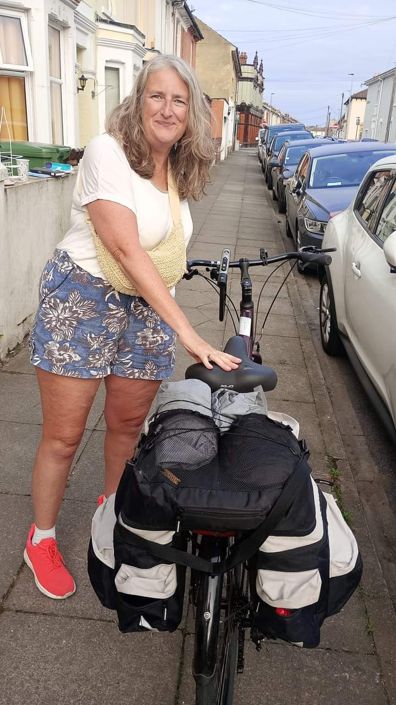
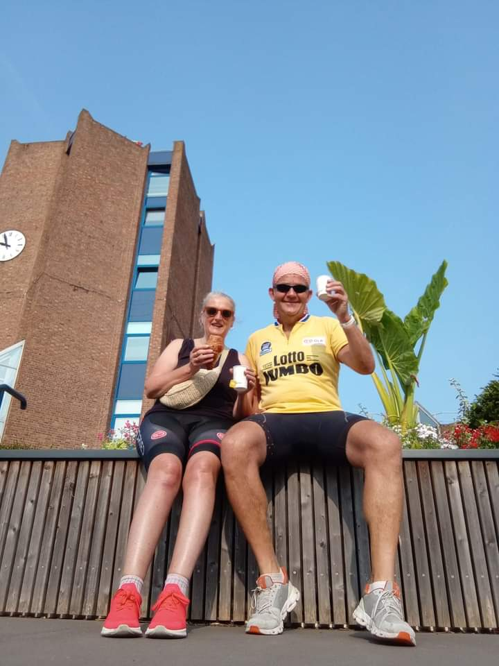
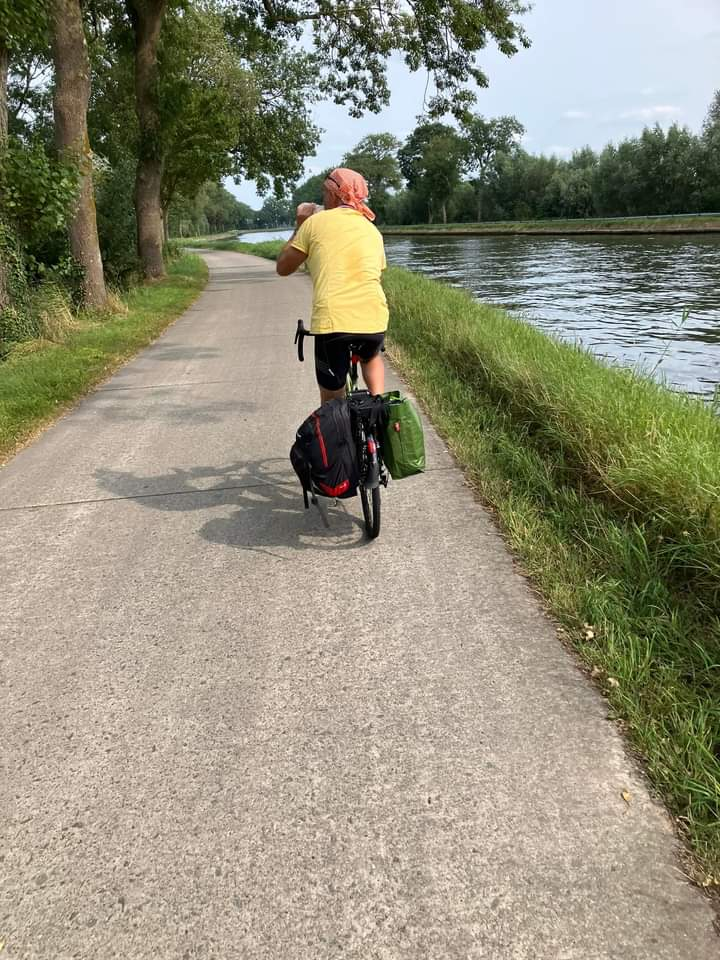

Even though summer has passed and the skies have turned a bit grey, it’s a joy to share Eric and Vicky’s story about their summer cycling adventures in Belgium. Eric and Vicky are regular cyclists in our city and beyond, and their journey experience may be useful for planning your own cycling holiday!

# From Portsmouth to Bruges by bike, train and ferry

My wife Vicky and I decided to go to Bruges for a few days. Plan was to get the bikes on the train to Dover, take the ferry to Dunkirk and cycle to Bruges, which was about 90km.
The train journey to Dover went very smoothly although there wasn't anywhere to leave our bikes on the train from London to Dover so we had to stand with our bikes for the duration of the trip as they were blocking the aisles and doors.

Upon arrival in Dover it took us a while to find our way to the ferry port on our bikes, but with Google maps and the odd sign on the road or pavement we managed to get there. Once we arrived at the ferry port we had to find our way to the DFDS office to convert our reservation into tickets and with the help of a friendly chap from Irish Ferries we overcame this hurdle too. We  conveniently ignored the few "cyclists dismount" signs that seemed the port's biggest investment in cycling infrastructure.

We got onto the ferry, locked our bikes and went to the passenger deck, a pleasant crossing.

# Cycling through the port and Dunkirk

The ferry port of Dunkirk is about 15km south of the city, and we had booked overnight accommodation in a small suburb as it was about 5pm when we arrived in France. We got off the ferry, shared the road with considerate drivers, and enjoyed the dedicated cycle paths once we left the ferry port area.

General comment, we often use Google maps to find our way on bikes but the spoken instructions are often confusing. I learned to look at the map on my phone which I had placed in a holder on my handle bars and have the sound switched off.

Also, we travelled on a Sunday and outside the big cities the Sunday is sacred as a day of rest, hardly any shops or restaurants were open early evening.

# En route to Bruges

We got on our bikes on Monday morning (me on my brand new Genesis road bike from BikeYouLike, Vicky on her city commuter bike, both with panniers), left Dunkirk and followed the coast. It wasn't the shortest route but we had a lovely family holiday in De Panne 20 years ago and wanted to ride past that area. 

The Flemish seaside is beautiful and the cycle lanes are a joy to ride. We rode along the coast to Middelkerke where we stopped for a cold beer and dip in the sea, then when we got to Ostend we followed the canal all the way to Bruges. 

Bruges itself is a gem of a city, very friendly, well preserved historic buildings, delicious beers, and probably my highlight was a stretch of a canal that was marked for public swimming, water temperature and quality tested regularly to ensure swimmers' safety, life guards looked after us, and there were paddle boards that we could use. All this for free!

# The challenging journey home

After three nights it was time to cycle back to Dunkirk. Our ferry was due to leave at 4pm and the weather forecast said 25mph headwind all the way to Dunkirk so we set off at about 8am, allowing time for breaks. This time we took the shortest route that Google had on offer and didn't see the coast until we got to the French border. The wind was relentless, the route stunning and safe on quiet roads or cycle paths, until we reached Dunkirk. We negotiated about 5 miles of urban traffic, got out safe on the other side and cycled to the ferry port. This is where Google maps let us down, it sent us in circles before admitting that it didn't have a clue where it was taking us. A friendly driver - we didn't see many which was worrying - sent us in the right direction, we got to the port at 3:30, only to find that our crossing was delayed by 90 minutes due to adverse weather conditions.... It meant that we were going to miss our train to Dover and get home close to midnight. But it got worse. 

# Experience at the port in Dover

When the ferry arrived in Dover the seven cyclists on board, all of whom had cycled further that day than we had, were told to wait until every single car had left the vessel. It was getting dark, we were tired, were sent round the ferry port following the cycle lane that was marked with dark red paint, had to wait for a locked gate, and the knock on effect was that we got home at about 1am.

We had an unforgettable holiday, I recommend cycling in Flanders and Northern France (I am writing this on the train home after a long weekend in Lille where we used the public cycle hire scheme to ride to Roubaix and back, about 10k each way), motorists are patient and considerate, cycle paths everywhere, but I can't help feeling that Dover ferry port and DFDS are operating a "hostile environment" policy for cyclists. DFDS have yet to react to my customer feedback.

# From PCF Team

We want to give a big thanks to Eric and Vicky for sharing their cycling story! We hope their experience will be helpful for others planning their own cycling trips. Their story shows that there’s so much to enjoy on a cycling holiday, even when the infrastructure isn’t always perfect.
